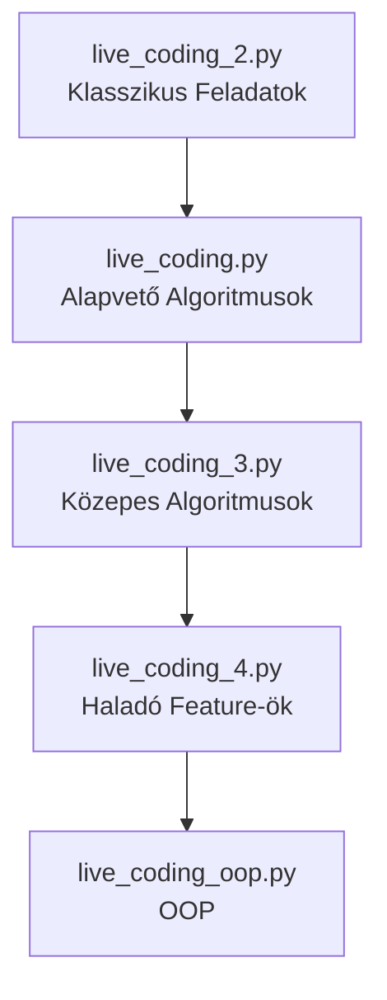

# Python Oktatóanyag - Live Coding Gyűjtemény

Átfogó Python oktatóanyag kezdőtől haladó szintig, gyakorlati feladatokkal és többféle megoldási móddal.

## 📚 Tartalom

Ez a repository öt progresszív Python oktatófájlt tartalmaz, amelyek lefedik az alapvető algoritmusoktól az objektum-orientált programozásig terjedő témákat.

### Fájlok Áttekintése

```
📁 vsCode/
├── 📄 live_coding.py          # Alapvető algoritmusok
├── 📄 live_coding_2.py        # Klasszikus programozási feladatok
├── 📄 live_coding_3.py        # Közepes algoritmusok
├── 📄 live_coding_4.py        # Haladó Python feature-ök
└── 📄 live_coding_oop.py      # Objektum-orientált programozás
```

---

## 🎯 Tanulási Útvonal



**Ajánlott sorrend:**
1. **Kezdő:** `live_coding_2.py` → `live_coding.py` (1-5. feladat)
2. **Középhaladó:** `live_coding.py` (6-10. feladat) → `live_coding_3.py`
3. **Haladó:** `live_coding_4.py` (1-5. feladat) → `live_coding_oop.py` (alapverzió)
4. **Expert:** `live_coding_4.py` (6-7. feladat) → `live_coding_oop.py` (haladó verzió)

---

## 📖 Részletes Fájl Leírások

### 1. live_coding.py - Alapvető Algoritmusok
**Nehézség:** 🟡 Kezdő-Középhaladó

Klasszikus algoritmusok és adatszerkezetek gyakorlása.

**Feladatok:**
- ✅ Palindróma ellenőrzés
- ✅ Duplikátumok eltávolítása
- ✅ Karakterek számolása (frequency counter)
- ✅ Fibonacci sorozat
- ✅ Anagramma ellenőrzés
- ✅ Two Sum probléma (O(n) megoldás)
- ✅ Bináris keresés (O(log n))
- ✅ Zárójelek validálása (stack)
- ✅ Maximum szubrész összeg (Kadane)
- ✅ Leggyakoribb elem keresése

**Kulcs Koncepciók:**
- Időkomplexitás: O(n), O(n²), O(log n)
- Adatszerkezetek: list, dict, stack
- Hash map optimalizálás

---

### 2. live_coding_2.py - Klasszikus Programozási Feladatok
**Nehézség:** 🟢 Kezdő

Alapvető programozási minták és gondolkodásmód.

**Feladatok:**
- ✅ FizzBuzz
- ✅ Prímszám ellenőrzés (optimalizált √n)
- ✅ Faktoriális (iteratív + rekurzív)
- ✅ Lista összegzés és átlag
- ✅ String megfordítás (3 különböző módszer)

**Kulcs Koncepciók:**
- Iteratív vs rekurzív megközelítés
- Matematikai optimalizálás
- Többféle megoldási mód

---

### 3. live_coding_3.py - Közepes Algoritmusok
**Nehézség:** 🟡 Középhaladó

Haladóbb string műveletek és algoritmusok.

**Feladatok:**
- ✅ Két rendezett lista egyesítése (merge)
- ✅ Első egyedi karakter keresése
- ✅ Rotált string ellenőrzés
- ✅ Leghosszabb szó megadott betűkből
- ✅ Caesar cipher titkosítás/visszafejtés

**Kulcs Koncepciók:**
- Two-pointer technika
- String algoritmusok
- Karakterkódolás (ord, chr)
- Titkosítási alapok

---

### 4. live_coding_4.py - Haladó Python Feature-ök
**Nehézség:** 🔴 Haladó

Python nyelvspecifikus haladó funkciók.

**Feladatok:**
- ✅ Top N leggyakoribb elem (sorting + lambda)
- ✅ Permutációk generálása (rekurzív)
- ✅ Email validáció (regex)
- ✅ URL parser (komplex string parsing)
- ✅ JSON flattening (nested dict kezelés)
- ✅ Dekorátorok:
  - Timer (időmérés)
  - Memoization (cache)
  - Call counter (hívásszámlálás)
- ✅ Context Manager (`with` statement)

**Kulcs Koncepciók:**
- Python dekorátorok (@wraps)
- `*args` és `**kwargs`
- Context manager protokoll (`__enter__`, `__exit__`)
- Regex pattern matching
- Rekurzív adatszerkezet feldolgozás

---

### 5. live_coding_oop.py - Objektum-Orientált Programozás
**Nehézség:** 🟡🔴 Középhaladó-Haladó

Gyakorlati OOP projekt: Könyvtár kezelő rendszer.

**Projekt:** Library Management System

#### Alapverzió
**Book osztály:**
- Attribútumok: `title`, `author`, `isbn`, `available`
- Metódusok: `borrow()`, `return_book()`

**Library osztály:**
- Attribútumok: `name`, `books[]`
- Metódusok: `add_book()`, `remove_book()`, `find_book()`, `list_available_books()`, `borrow_book()`

#### Haladó Verzió (Dekorátorral)
- 🎨 `@log_action` dekorátor (metódus naplózás)
- 📦 `*args` használat (több könyv inicializálása)
- 🔧 `**kwargs` használat (opcionális attribútumok: year, genre, pages)
- 🔍 Flexibilis keresés (több szempont alapján)
- 📊 Statisztika funkció

**Kulcs Koncepciók:**
- OOP alapelvek (encapsulation)
- Magic methods (`__init__`, `__str__`)
- Dekorátorok osztálymetódusokkal
- Objektumok közötti kapcsolatok

---

## 🛠️ Lefedett Témakörök

### Adatszerkezetek
- ✅ Lista (list)
- ✅ Szótár (dictionary)
- ✅ Halmaz (set)
- ✅ String
- ✅ Stack implementáció
- ✅ Nested struktúrák

### Algoritmusok
- ✅ Keresés (lineáris, bináris)
- ✅ Rendezés (sorting, lambda)
- ✅ Rekurzió
- ✅ Dinamikus programozás (Kadane)
- ✅ Two-pointer technika
- ✅ Backtracking (permutációk)

### Python Feature-ök
- ✅ List comprehension
- ✅ Dictionary comprehension
- ✅ Lambda függvények
- ✅ Dekorátorok
- ✅ Context managerek
- ✅ `*args` és `**kwargs`
- ✅ Magic methods
- ✅ Regex (re modul)
- ✅ functools.wraps

### Programozási Minták
- ✅ Iteratív vs rekurzív
- ✅ Memoization (cache)
- ✅ Lazy evaluation
- ✅ OOP design patterns

---

## 🚀 Használat

### Követelmények
```bash
Python 3.6+
```

### Futtatás
```bash
# Egyszerűen futtasd a fájlokat:
python live_coding.py
python live_coding_2.py
python live_coding_3.py
python live_coding_4.py
python live_coding_oop.py
```

### Tanulási Tippek
1. **Olvasd el a feladat leírását** a docstring-ben
2. **Próbáld meg magad megoldani** mielőtt megnézed a megoldást
3. **Értsd meg a különböző megoldásokat** - miért jobb az egyik a másiknál?
4. **Figyeld az időkomplexitást** - O(n) vs O(n²) vs O(log n)
5. **Módosítsd a kódot** - experimentálj különböző inputokkal

---

## 📊 Összefoglaló Táblázat

| Fájl | Nehézség | Feladatok száma | Fő Témák |
|------|----------|-----------------|----------|
| `live_coding_2.py` | 🟢 Kezdő | 5 | Ciklusok, rekurzió, alapműveletek |
| `live_coding.py` | 🟡 Kezdő-Közép | 10 | Algoritmusok, adatszerkezetek |
| `live_coding_3.py` | 🟡 Középhaladó | 5 | String műveletek, two-pointer |
| `live_coding_4.py` | 🔴 Haladó | 7 | Dekorátorok, regex, context manager |
| `live_coding_oop.py` | 🟡🔴 Közép-Haladó | 1 projekt | OOP, osztályok, dekorátorok OOP-ben |

---

## 💡 Példa Kód Snippetek

### Példa 1: Two Sum Optimalizált (O(n))
```python
def two_sum(nums, target):
    num_indices = {}
    for index, num in enumerate(nums):
        complement = target - num
        if complement in num_indices:
            return [num_indices[complement], index]
        num_indices[num] = index
    return []
```

### Példa 2: Dekorátor Időmérésre
```python
import time
from functools import wraps

def timer(func):
    @wraps(func)
    def wrapper(*args, **kwargs):
        start_time = time.time()
        result = func(*args, **kwargs)
        end_time = time.time()
        print(f"{func.__name__} futási ideje: {end_time - start_time:.6f} másodperc")
        return result
    return wrapper

@timer
def slow_function():
    time.sleep(1)
    return "Kész"
```

### Példa 3: Context Manager
```python
class Timer:
    def __enter__(self):
        self.start = time.time()
        return self

    def __exit__(self, exc_type, exc_value, traceback):
        self.end = time.time()
        self.elapsed = self.end - self.start
        print(f"Eltelt idő: {self.elapsed:.4f} másodperc")
        return False

with Timer():
    # Kód végrehajtása
    time.sleep(0.5)
```

---

## 🎓 Tanulási Célok

### Kezdő szint után tudni fogod:
- ✅ Alapvető adatszerkezetek használata
- ✅ Ciklusok és feltételek
- ✅ Függvények írása
- ✅ Lista és dictionary műveletek

### Középhaladó szint után tudni fogod:
- ✅ Algoritmusok időkomplexitása
- ✅ Hash map optimalizálás
- ✅ String manipuláció
- ✅ Rekurzív gondolkodás

### Haladó szint után tudni fogod:
- ✅ Dekorátorok írása és használata
- ✅ Context managerek
- ✅ `*args` és `**kwargs` gyakorlati használata
- ✅ Regex mintaillesztés
- ✅ OOP tervezési minták

---

## 🤝 Közreműködés

Ez egy oktatási projekt. Javaslatokat és fejlesztéseket szívesen fogadunk!

---

## 📄 Licenc

Ez egy oktatási célú projekt. Szabadon használható és módosítható.

---

## 📞 Kapcsolat

Ha kérdésed van a feladatokkal kapcsolatban, nyiss egy issue-t vagy küldj pull request-et!

---

**Jó tanulást! 🚀**
